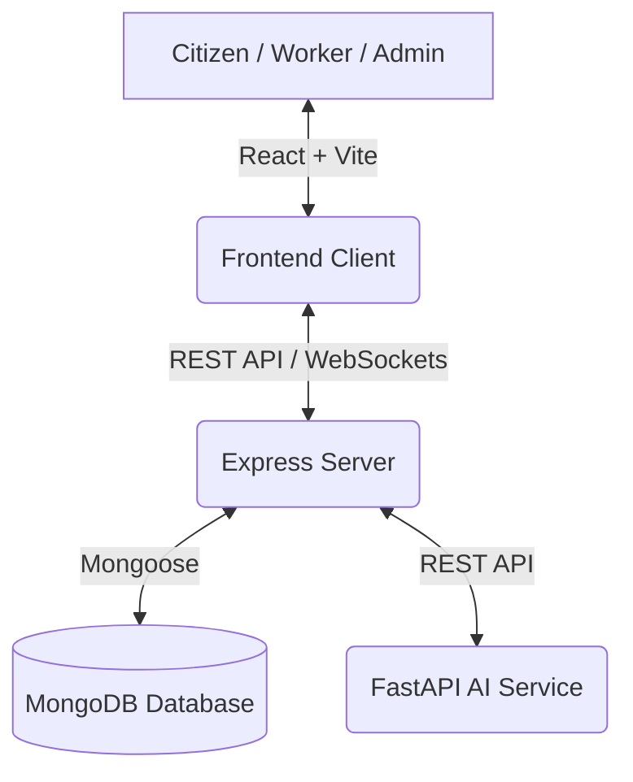

# 🏛️ Civic Pulse

Civic Pulse is an AI-powered municipal issue reporting and tracking platform designed to bridge the gap between citizens, sanitation/maintenance workers, and city administration.

Citizens can report civic issues (like potholes or garbage heaps), which are auto-classified and verified by an AI service. City administrators can assign tasks to municipal workers, who resolve the issues and upload proof of resolution (which is cross-checked using AI image verification to prevent fraud).

---

## 🌟 Key Features

* **Citizen Dashboard**: Report issues, upload photos, pin location, track status live, and receive real-time updates via WebSockets.
* **Worker Dashboard**: View assigned tasks, update progress, upload "before" and "after" photos for verification, and close tasks.
* **Admin Control Center**: Analyze system-wide statistics, assign complaints to specific workers, and manage user roles.
* **AI Image Verification**: Automatic verification of resolved issues by comparing before/after photos and detecting stock/duplicate images.
* **Live Updates**: Real-time notifications and status updates powered by Socket.io.

---

## 🏗️ System Architecture

The project is structured as a monorepo consisting of three components:



---

## 🛠️ Tech Stack

### 1. Frontend Client (`civic-pulse-frontend`)
* **Framework**: React.js with Vite
* **Styling**: Tailwind CSS
* **Routing**: React Router DOM
* **State & Real-time**: React Context API, Socket.io Client

### 2. Backend API (`civic-pulse-backend`)
* **Runtime**: Node.js & Express.js
* **Database**: MongoDB (via Mongoose ODM)
* **Real-time Comm**: Socket.io
* **Authentication**: JWT & bcryptjs for secure role-based access control
* **File Uploads**: Multer middleware

### 3. AI Service (`civic-pulse-ai-service`)
* **Framework**: FastAPI (Python)
* **Image Processing**: OpenCV & NumPy
* **Mock AI/Verification**: Simulated YOLOv8 classification (pothole/garbage detection) and image-comparison heuristic.

---

## 🚀 Setup & Installation

Follow these steps to run all services locally.

### Prerequisites
* [Node.js](https://nodejs.org/) (v16+ recommended)
* [MongoDB](https://www.mongodb.com/) (running locally or a MongoDB Atlas URI)
* [Python 3.8+](https://www.python.org/)

---

### Step 1: Run the Backend API

1. Navigate to the backend directory:
   ```bash
   cd civic-pulse-backend
   ```
2. Install dependencies:
   ```bash
   npm install
   ```
3. Create a `.env` file in `civic-pulse-backend/` with the following configuration:
   ```env
   PORT=5000
   MONGO_URI=mongodb://localhost:27017/civic_pulse
   JWT_SECRET=your_jwt_secret_key_here
   ```
4. Start the server:
   - For production: `npm start`
   - For development (with hot reload): `npm run dev`

---

### Step 2: Run the AI Service

1. Navigate to the AI service directory:
   ```bash
   cd civic-pulse-ai-service
   ```
2. Set up a Python virtual environment and activate it:
   ```bash
   python -m venv venv
   # On Windows (PowerShell):
   .\venv\Scripts\Activate.ps1
   # On macOS/Linux:
   source venv/bin/activate
   ```
3. Install dependencies:
   ```bash
   pip install fastapi uvicorn opencv-python numpy python-multipart
   ```
4. Run the FastAPI server:
   ```bash
   python main.py
   ```
   The service will start running on `http://localhost:8000`.

---

### Step 3: Run the Frontend Client

1. Navigate to the frontend directory:
   ```bash
   cd civic-pulse-frontend
   ```
2. Install dependencies:
   ```bash
   npm install
   ```
3. Start the Vite dev server:
   ```bash
   npm run dev
   ```
4. Open [http://localhost:5173](http://localhost:5173) in your browser.

---

## 🔒 Role Credentials for Testing

To log in and test different interfaces, use the credentials below (ensure the database is running and populated):

| Role | Username | Password |
| :--- | :--- | :--- |
| **Admin** | `admin` | `admin123` |
| **Worker** | `worker` | `worker123` |
| **Citizen** | `citizen` | `citizen123` |
